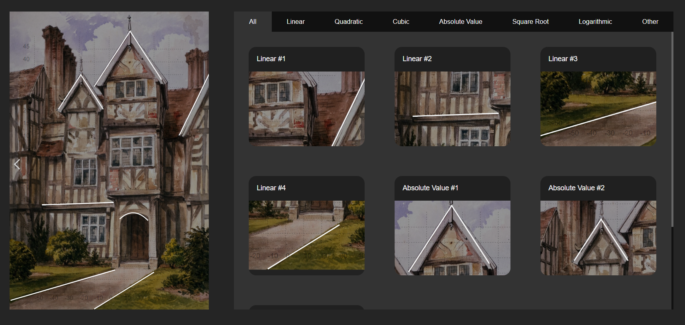

# The Art of Mathematics

Available at https://theartofmathematics.github.io

Welcome to __The Art of Mathematics__. This project is influenced by [Mr. Evgeny Tuev](http://pattisonhighschool.ca/teachers/mr-evgeny-tuev/) and developed by Erfan Golpour. It tries to show how mathematical functions appear in nature and industry. Before you move on, please take a moment to read the instructions:
  
* When you hover the mouse over a function in the preview panel, the corresponding function will be highlighted on the graph to help you easily find a function.
* Use the white arrows on the main picture to switch between the sets of functions. For now there are 2 sets available.
* Click on each function to see a more detailed discription about it. You can also gain information about a function by hovering over it.
* Even though the functions are all precisely calculated, the key points are __NOT__ manually identified. There is a loop which goes through the domain of each function and determines 10 integral points at most (where x and y are both integers). Therefore, it is possible to encounter a function that has no key points.

__Attention:__
Since the website is primirily designed for landscape frames, it is recommended to use a horizontal screen while you are using the website. Otherwise, you might face some disproportions although the contents will remain the same.

**Enjoy!**
